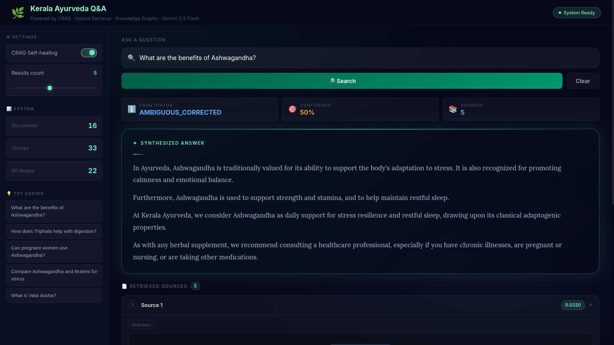
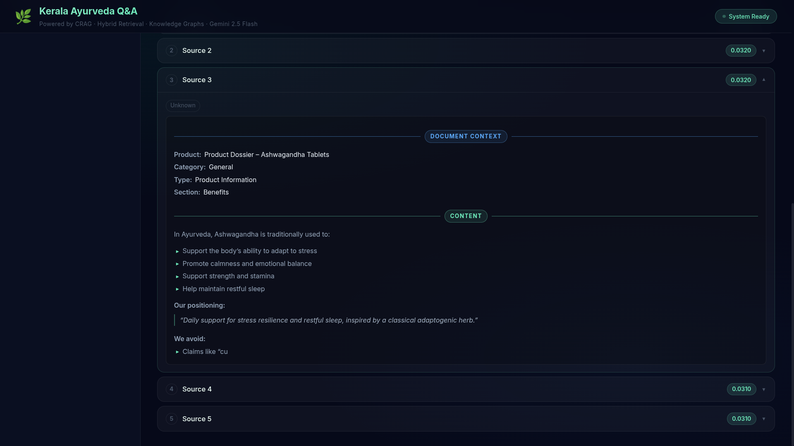

# 🌿 Kerala Ayurveda Agentic AI

**Production-ready Agentic Retrieval-Augmented Generation system for authentic Ayurveda content**

A sophisticated multi-layered RAG system featuring **Corrective RAG (CRAG)**, hybrid semantic retrieval, knowledge graph grounding, and a premium glassmorphic React interface. Powered by **Google Gemini 2.5 Flash**.

[](https://www.python.org/downloads/)
[](https://ai.google.dev/)
[](https://fastapi.tiangolo.com/)
[](https://react.dev/)
[](https://opensource.org/licenses/MIT)

---

## 📷 Visual Demo

### Premium Glassmorphic Interface

*Modern, responsive dashboard featuring real-time metrics, CRAG status toggles, and reactive search.*

### Rich Source Rendering

*Advanced source tracking with color-coded document context, field highlighting, and relevance scoring.*

---

## 📖 Key Features

This system solves the critical challenge of generating **accurate and safe Ayurveda guidance** while eliminating hallucinations.

- 🔍 **Corrective RAG (CRAG)** - Self-healing retrieval that evaluates context quality before generating.
- 🔗 **Hybrid Semantic Search** - Combines BM25 keyword matching with Gemini dense vector embeddings.
- 🕸️ **Knowledge Graph Grounding** - Injects structural relationships (herbs → doshas → benefits) into prompts.
- 🤖 **Agentic Workflow** - Multi-strategy query transformation (Rewrite, Decompose, Step-Back, HyDE).
- ✅ **Authentic Voice** - Strictly grounded in a curated Kerala Ayurveda corpus.
- 🎨 **Premium UI** - Dark-themed, glassmorphic React app with detailed auditing tools.

**See [System Documentation](./docs/overview.md) for a technical deep-dive.**

---

## 🚀 Quick Start

### 1. Install Dependencies
This project uses `uv` for lightning-fast Python management.

```bash
# Install uv
curl -LsSf https://astral.sh/uv/install.sh | sh

# Setup environment & install packages
uv sync
```

### 2. Configure Environment
Create a `.env` file in the root directory:

```bash
GOOGLE_API_KEY="your_gemini_api_key"
GOOGLE_MODEL="models/gemini-2.5-flash"
GOOGLE_EMBEDDING_MODEL="models/text-embedding-004"
```

---

## 🎯 How to Run

### Option 1: Full Web Experience (Recommended)

1. **Start Backend**:
   ```bash
   uv run python run_api.py
   ```
2. **Start Frontend**:
   ```bash
   cd frontend
   npm install
   npm run dev
   ```
**Stats Dashboard:** http://localhost:5173

---

### Option 2: CLI Operations

- **Run Pipeline Demo**:
  ```bash
  uv run python scripts/main_pipeline.py
  ```
- **Run Quality Benchmarks**:
  ```bash
  uv run python scripts/run_evaluation.py
  ```

---

## 🏗️ System Architecture

### 5-Step Agentic Pipeline
1. **Transform**: Analyze query and apply optimal strategy (Rewrite/HyDE).
2. **Retrieve**: Parallel BM25 + Vector search over `data/raw/`.
3. **Graph-Augment**: Inject structured relationships from the Knowledge Graph.
4. **Evaluate (CRAG)**: Score retrieved context. Trigger "Self-healing" if below threshold.
5. **Synthesize**: Gemini 2.5 Flash generates a grounded, professional response.

### Tech Stack
| Component | Technology |
| --- | --- |
| **Logic Engine** | Python 3.12 / FastAPI |
| **LLM / Embeddings** | Google Gemini 2.5 Flash |
| **Vector Index** | ChromaDB |
| **Frontend** | React 18 / Vite / Vanilla CSS (Glassmorphism) |
| **Graph** | NetworkX |
| **Package Manager** | UV |

---

## 📁 Project Structure

```text
Kerala-Ayurveda-Agentic-AI/
├── src/                      # Core logic (API, Retrieval, Agents)
├── scripts/                  # CLI tools and setup utilities
├── frontend/                 # React/Vite web application
├── data/
│   ├── raw/                  # Ground truth Markdown/CSV corpus
│   └── indexes/              # Serialized BM25/Vector caches
├── docs/                     # Comprehensive technical documentation
├── assets/                   # Media and screenshots
├── run_api.py                # Main server entry point
└── pyproject.toml            # Project configuration
```

---

## 📜 Documentation
- [Architecture Overview](./docs/architecture.md)
- [Agentic RAG Deep Dive](./docs/rag_pipeline.md)
- [API Reference](./docs/api_reference.md)
- [Folder Structure Explanation](./docs/folder_structure.md)

---