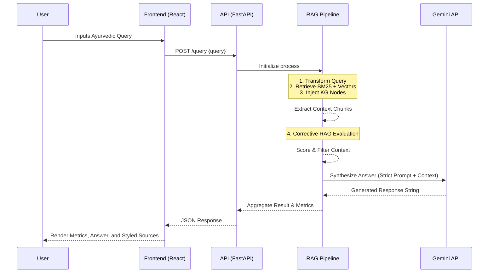

# Detailed System Architecture

The overarching architecture of the Kerala Ayurveda Agentic AI strictly separates the presentation layer from the cognitive backend, connected exclusively via RESTful APIs.

## Presentation Layer: React Frontend
- **Technology Stack:** React 18, Vite, Vanilla CSS.
- **Design Philosophy:** Emphasizes a "Glassmorphism" aesthetic with a dark premium theme. It is designed to expose the internal workings of the AI transparently to the user, acting as both an end-user tool and an auditing dashboard.
- **State Flow:** React manages asynchronous states using modern hooks. When a query is initiated, the UI displays a "Thinking..." state, awaiting the backend's complete JSON payload containing metrics, confidence scores, and the generated answer.

## Cognitive Layer: FastAPI Backend
- **Framework:** FastAPI was chosen for its asynchronous capabilities, extremely fast execution, and native support for Pydantic data validation.
- **Startup Lifecycle:** The application uses a `lifespan` architecture. On startup, it performs heavy initialization tasks: reading the raw corpus, chunking text, generating or loading BM25 indices, building the Knowledge Graph, and configuring the Gemini API clients. This ensures that the endpoints remain incredibly fast during request handling.

## Service Integration: Google Gemini
- **Model Used:** `models/gemini-2.5-flash` natively handles both text embedding generation (via `models/gemini-embedding-001`) and final answer synthesis.
- **Prompt Engineering:** The backend constructs highly specific, injected prompts that force the LLM to strictly rely on the provided context chunks and adopt a specific Ayurvedic voice.

## Workflow Diagram

